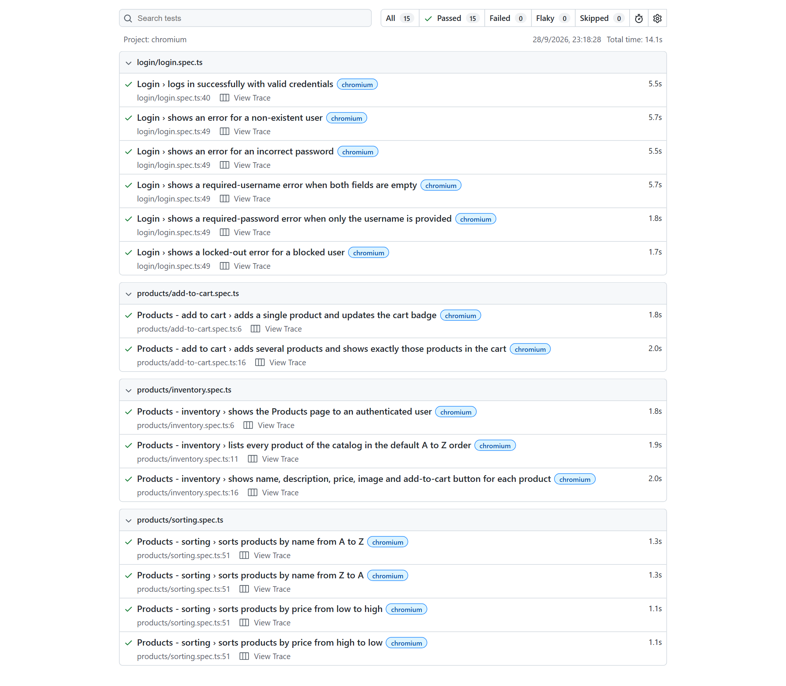
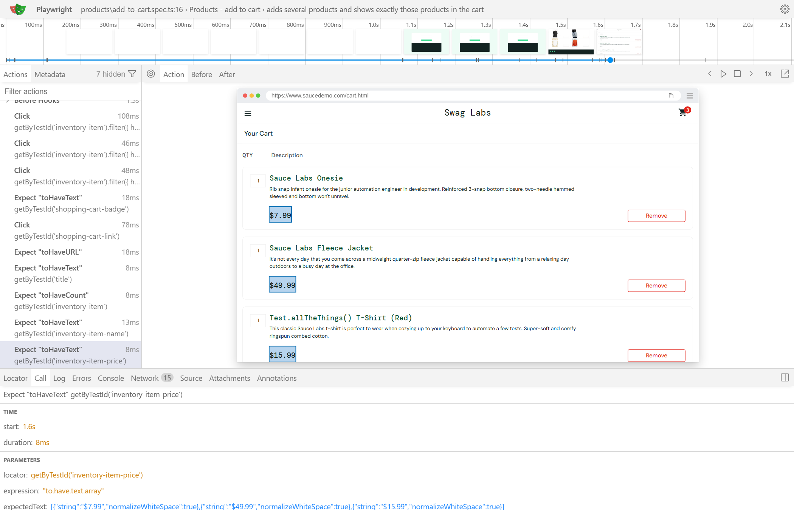

# QA Automation Portfolio

[](https://github.com/LautaroSando/qa-automation-portfolio/actions/workflows/playwright.yml)


## Project Overview

An end-to-end test automation framework built with **Playwright** and **TypeScript**, targeting the [SauceDemo](https://www.saucedemo.com/) e-commerce demo application.

The focus is engineering quality, not test volume. The goal is a clean, scalable foundation that another QA engineer can join and extend without rewriting the architecture. It follows the same conventions I apply to client projects.

> **Status:** the **Login** and **Products** modules are implemented. Cart and checkout flows are next. See [Future Improvements](#future-improvements).

## Objectives

- Show how to design a maintainable web automation framework from scratch.
- Apply Page Object Model and fixtures with a clear separation between data, actions and assertions.
- Write tests that fail for the right reasons: no fixed waits, no order dependencies, no false positives.
- Run tests automatically in CI and keep reports and failure evidence available.
- Leave room for API automation (Karate DSL) without mixing toolchains.

## Tech Stack

| Area | Tools |
| --- | --- |
| Web automation | Playwright Test, TypeScript (strict mode), Node.js 20+ |
| Patterns | Page Object Model, Playwright fixtures, data-driven tests |
| CI/CD | GitHub Actions |
| Reporting | Playwright HTML report, traces, screenshots and videos on failure |

No extra runtime dependencies are used beyond Playwright itself.

## Architecture

The framework is organized in layers, each with a single responsibility:

| Layer | Folder | Responsibility |
| --- | --- | --- |
| Scenarios | `tests/` | Business scenarios and assertions, grouped by feature |
| Page Objects | `pages/` | Locators and user actions for each page |
| Fixtures | `fixtures/` | Build page objects and prepare the initial state of each test |
| Test data | `test-data/` | Demo users, expected messages and the product catalog |
| Utilities | `utils/` | Environment configuration and pure helpers (price formatting, sorting) |

Key design decisions:

- **Assertions live in tests, not in page objects.** Page objects expose locators and business actions such as `addToCart` or `sortBy`. Tests decide what to verify, so page objects stay reusable.
- **Stable locators.** SauceDemo exposes `data-test` attributes, so `testIdAttribute` is set to `data-test` and locators use `getByTestId`. Products are located by their visible name rather than by generated ids like `add-to-cart-sauce-labs-backpack`.
- **Fixtures instead of setup boilerplate.** `loginPage` opens the login screen. `authenticatedProductsPage` logs in as the standard user and lands on the inventory. Login goes through the UI on purpose: it takes about a second and keeps every test fully self-contained.
- **Expected results come from test data, not from the UI.** Sorting and cart tests compare the page against the catalog in `test-data/products.ts`. A test cannot pass by comparing the UI with itself.
- **Guarding against false positives.** Each sorting test first applies the opposite order and checks that the list changed. Without this, "Name (A to Z)" would pass even if sorting were broken, because it is the default order. This was verified by disabling sorting and confirming that all four tests fail.
- **Data-driven scenarios.** Negative login cases and sort options are defined as tables and run by one test body. A new case is a new row, not a copied test.
- **Web-first assertions only.** All checks use Playwright's auto-retrying `expect`, with no `waitForTimeout` calls.
- **Isolation for parallel runs.** Each test gets a fresh browser context, so cart state never leaks between tests and the suite runs fully parallel.
- **Single environment entry point.** `utils/env.ts` reads environment variables with defaults and rejects invalid values with a clear error.

## Test Coverage

15 automated scenarios on Chromium.

**Login** (`tests/login/login.spec.ts`)

| Scenario | Validates |
| --- | --- |
| Successful login with valid credentials | Redirect to the inventory, page title and product list |
| Non-existent user | Invalid-credentials error, user stays on the login page |
| Incorrect password | Invalid-credentials error, user stays on the login page |
| Both fields empty | Username-required error |
| Username without password | Password-required error |
| Locked-out user | Locked-out error |

**Products: inventory** (`tests/products/inventory.spec.ts`)

| Scenario | Validates |
| --- | --- |
| Authenticated user reaches the inventory | URL and "Products" title |
| Catalog is listed | Exact product count and names in the default A to Z order |
| Product details | Description, price, image and "Add to cart" button for every product |

**Products: sorting** (`tests/products/sorting.spec.ts`)

| Scenario | Validates |
| --- | --- |
| Name A to Z | Names in ascending alphabetical order |
| Name Z to A | Names in descending alphabetical order |
| Price low to high | Prices in ascending order |
| Price high to low | Prices in descending order |

**Products: add to cart** (`tests/products/add-to-cart.spec.ts`)

| Scenario | Validates |
| --- | --- |
| Add a single product | Badge goes from hidden to 1 and the button switches to "Remove" |
| Add several products | Badge count, then the cart shows exactly the selected names and prices |

## Installation

Requirements: Node.js 20 or newer.

```bash
npm install
npm run browsers:install
```

## Execution

| Command | Description |
| --- | --- |
| `npm test` | Run all tests headless |
| `npm run test:login` | Run only the login module |
| `npm run test:products` | Run only the products module |
| `npm run test:headed` | Run with a visible browser |
| `npm run test:ui` | Open Playwright UI mode to run and inspect tests interactively |
| `npm run test:debug` | Run step by step with the Playwright Inspector |
| `npm run report` | Open the last HTML report |
| `npm run typecheck` | Type-check the whole project |
| `npm run browsers:install` | Install the Chromium browser used by the tests |

Extra Playwright arguments can be passed after `--`, for example `npm test -- -g "sorts products"`.

Configuration through environment variables:

| Variable | Default | Purpose |
| --- | --- | --- |
| `BASE_URL` | `https://www.saucedemo.com` | Application under test |
| `RETRIES` | `2` | Retries in CI |
| `WORKERS` | `2` | Parallel workers in CI |

Local and CI runs behave differently on purpose:

| Setting | Local | CI |
| --- | --- | --- |
| Retries | 0 | `RETRIES` (default 2) |
| Workers | Playwright default | `WORKERS` (default 2) |
| Traces | Kept for failed tests | Recorded on the first retry |
| `test.only` | Allowed | Fails the run |

## Test Reports

Every run produces Playwright's native HTML report in `playwright-report/`. Open it with `npm run report`.

The report shows each test's name, status, duration and error message. Failed tests also include a screenshot, a video and a Playwright trace. The trace can be opened from the report and replays every action with DOM snapshots, network calls and console output.

### Execution evidence

HTML report of a full run, with all 15 tests passing on Chromium:



Trace viewer replaying the multi-product cart test. The final step checks the cart prices against the test data, and the snapshot shows the page at that moment:



Both captures come from a local run with tracing enabled for every test. In CI, traces are recorded only on retries to keep runs fast.

## CI/CD

The workflow in `.github/workflows/playwright.yml` runs on every push to `main` and every pull request targeting `main`. It performs these steps:

1. Sets up Node.js 24 with npm caching.
2. Installs dependencies with `npm ci`.
3. Type-checks the project.
4. Installs Chromium and its system dependencies.
5. Runs the test suite with CI retries.
6. Uploads the HTML report and the raw test results, with traces, screenshots and videos, as artifacts. This happens even when tests fail, and artifacts are kept for 14 days.

## Project Structure

```
qa-automation-portfolio/
├── .github/workflows/
│   └── playwright.yml        # CI pipeline
├── docs/images/              # Report and trace screenshots used in this README
├── fixtures/
│   └── index.ts              # Extended `test` with page objects and login state
├── pages/
│   ├── LoginPage.ts
│   ├── ProductsPage.ts
│   └── CartPage.ts
├── test-data/
│   ├── users.ts              # Public SauceDemo demo users
│   ├── messages.ts           # Expected error messages
│   └── products.ts           # Product catalog with prices
├── tests/
│   ├── login/
│   │   └── login.spec.ts
│   └── products/
│       ├── inventory.spec.ts
│       ├── sorting.spec.ts
│       └── add-to-cart.spec.ts
├── utils/
│   ├── env.ts                # Environment variables with validation
│   └── products.ts           # Price formatting and expected sort orders
├── playwright.config.ts
├── tsconfig.json
└── package.json
```

The only credentials in the repository are the public demo users published on the SauceDemo login page.

## Future Improvements

- Cart management and checkout flow, including a `CheckoutPage`.
- API automation with Karate DSL (Java + Maven) in its own folder, so the toolchains stay separate.
- Cross-browser execution on Firefox and WebKit. The config is ready for extra projects.
- Reusing an authenticated session through `storageState` if the suite grows enough for UI login to matter.
- Publishing the HTML report from each CI run on GitHub Pages. Today it is available as a downloadable artifact.

## Services

This repository shows the way I work on client projects. I can help your team with:

- **Test automation frameworks from scratch.** Playwright and TypeScript projects with Page Object Model, fixtures and test data organized to grow with your product.
- **Regression suites for critical flows.** Automating login, checkout, forms and other flows that must never break, with tests designed to avoid false positives.
- **CI/CD integration.** Running your tests on every push or pull request with GitHub Actions, including reports and failure evidence.
- **Improving existing suites.** Fixing flaky tests, replacing fixed waits, stabilizing locators and removing duplication.
- **Test design and documentation.** Choosing what to automate, writing clear scenarios and documenting how to run and extend them.

## Author

**Lautaro Sandoval** — QA Automation Engineer

- GitHub: [@LautaroSando](https://github.com/LautaroSando)
- Available for freelance projects. Get in touch through GitHub.
